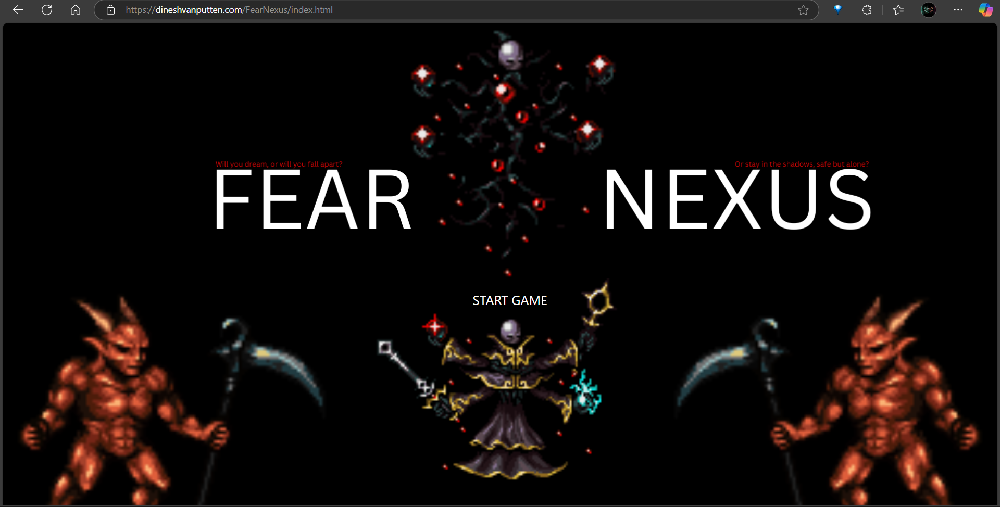
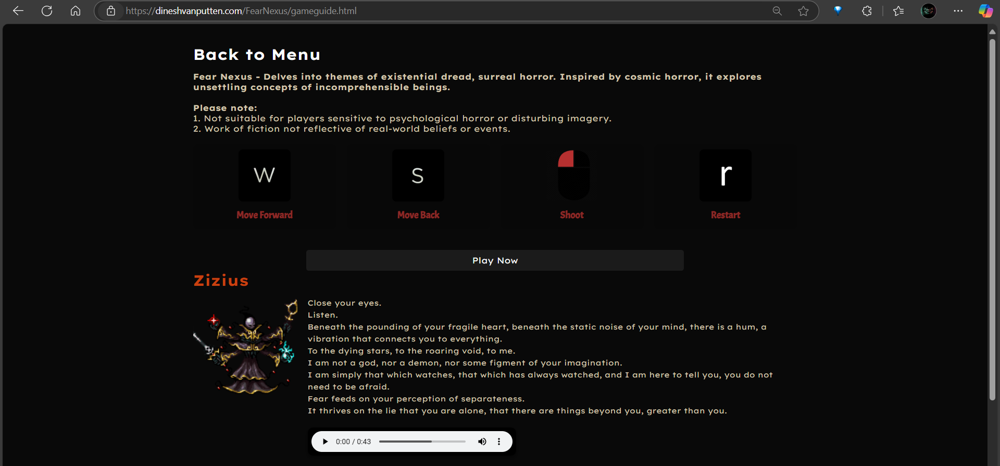
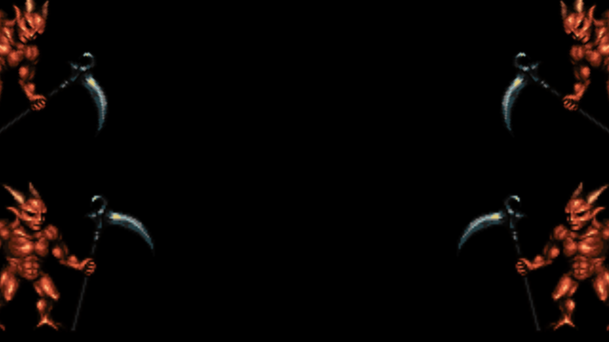
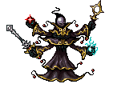
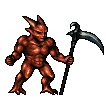
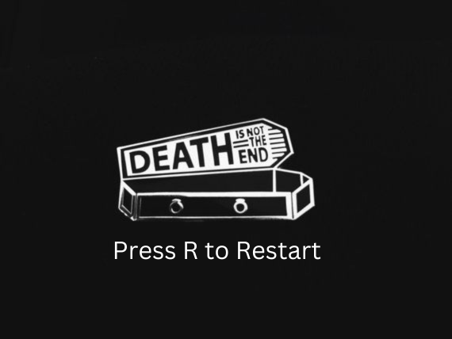

<div align="center">
  


</div>

# Fear Nexus Game Documentation

## Table of Contents
- [Fear Nexus Game Documentation](#fear-nexus-game-documentation)
  - [Table of Contents](#table-of-contents)
  - [Overview](#overview)
  - [Features](#features)
  - [Live Demo](#live-demo)
  - [Contributing](#contributing)
  - [Testing](#testing)
    - [1. Prerequisites](#1-prerequisites)
    - [2. Running the Game](#2-running-the-game)
    - [3. Test Cases](#3-test-cases)
      - [**Gameplay**](#gameplay)
      - [**UI and Responsiveness**](#ui-and-responsiveness)
      - [**Audio**](#audio)
      - [**Known Issues**](#known-issues)
    - [4. Reporting Bugs](#4-reporting-bugs)
  - [FAQ](#faq)
    - [Q: How do I play the game?](#q-how-do-i-play-the-game)
    - [Q: Can I contribute to the project?](#q-can-i-contribute-to-the-project)
    - [Q: What browsers are supported?](#q-what-browsers-are-supported)
    - [Q: Are there plans for mobile support?](#q-are-there-plans-for-mobile-support)
  - [Support](#support)
  - [Built With](#built-with)
  - [Project Structure (UML-like Representation)](#project-structure-uml-like-representation)
  - [Files and Pages](#files-and-pages)
    - [HTML Pages](#html-pages)
      - [`index.html`](#indexhtml)
      - [`gameguide.html`](#gameguidehtml)
      - [`gameplay.html`](#gameplayhtml)
    - [CSS Files](#css-files)
      - [`style.css`](#stylecss)
      - [`gameguide.css`](#gameguidecss)
      - [`gameplay.css`](#gameplaycss)
    - [JavaScript Files](#javascript-files)
      - [`script.js`](#scriptjs)
    - [Text Files](#text-files)
      - [`[FEAR].txt`](#feartxt)
      - [`When-the-sky-learned-to-breathe-backwards.txt`](#when-the-sky-learned-to-breathe-backwardstxt)
    - [Assets](#assets)
    - [Audio](#audio-1)
  - [How to Play](#how-to-play)
  - [Known Issues](#known-issues-1)
  - [Future Enhancements](#future-enhancements)
  - [Built With](#built-with-1)
  - [Installation](#installation)
  - [Development Notes](#development-notes)
  - [License](#license)
  - [Contact](#contact)

---

## Overview
Fear Nexus is a top-down shooter game where the player controls a character to shoot zombies while avoiding being attacked. The game features infinite scrolling backgrounds, various animations for the player and zombies, and sound effects to enhance the gameplay experience.

## Features
- **Player Movement:** Controlled via keyboard input.
- **Shooting Mechanic:** The player can fire bullets in bursts.
- **Zombie Behavior:** Zombies spawn at intervals, move toward the player, and attack upon collision.
- **Infinite Terrain:** Grass tiles shift seamlessly to simulate an infinite scrolling background.
- **Score System:** Tracks and displays the current and high scores.
- **Game Over Screen:** Displays when the player is overrun.
- **Animated Sprites:** For both the player and zombies.
- **Background Music:** Randomized tracks play during gameplay.

## Live Demo
You can try the game live here: [Fear Nexus Live Demo](https://dineshvanputten.com/FearNexus/index.html)  


## Contributing

Contributions are welcome and greatly appreciated! If you have ideas, suggestions, or improvements for the Fear Nexus project, please follow these steps:

1. **Fork the Repository**  
   Click the "Fork" button at the top of this repository to create your own copy.

2. **Clone the Repository**  
   Clone your forked repository to your local machine using the following command:
   ```bash
   git clone https://github.com/your-username/FearNexus.git

   ## Testing

To ensure the Fear Nexus game works as expected, follow these steps to test the project:

### 1. Prerequisites
- Ensure you have the following installed:
  - A modern web browser (e.g., Chrome, Firefox, Edge).
  - A local development server (e.g., [Live Server](https://marketplace.visualstudio.com/items?itemName=ritwickdey.LiveServer) for Visual Studio Code) if testing locally.

### 2. Running the Game
- **Option 1: Live Demo**
  - Visit the [Fear Nexus Live Demo](https://dineshvanputten.com/FearNexus/index.html) to play the game directly in your browser.
  
- **Option 2: Local Testing**
  1. Clone the repository to your local machine:
     ```bash
     git clone https://github.com/your-username/FearNexus.git
     ```
  2. Open the project folder in Visual Studio Code or your preferred IDE.
  3. Launch a local development server (e.g., right-click [index.html](http://_vscodecontentref_/0) and select "Open with Live Server").
  4. Open the game in your browser and test its functionality.

### 3. Test Cases
#### **Gameplay**
- Verify that the player can move using the `W` and `S` keys.
- Ensure the player can aim and shoot using the mouse.
- Confirm that zombies spawn and move toward the player.
- Check that bullets collide with zombies and remove them.
- Test the infinite scrolling background for seamless movement.
- Verify that the score updates correctly when zombies are eliminated.
- Confirm that the "Game Over" screen appears when the player is overrun.

#### **UI and Responsiveness**
- Test the start menu and game guide for proper navigation.
- Ensure the game is responsive on different screen sizes (desktop, tablet, mobile).
- Verify that buttons and links work as expected.

#### **Audio**
- Confirm that background music plays during gameplay.
- Test sound effects for shooting, zombie deaths, and the game over event.

#### **Known Issues**
- Check if any of the Known Issues occur during testing.

### 4. Reporting Bugs
If you encounter any issues or bugs, please report them by opening an issue in the [GitHub repository](https://github.com/your-username/FearNexus/issues). Include the following details:
- A clear description of the issue.
- Steps to reproduce the issue.
- Screenshots or error messages (if applicable).
- Your browser and operating system details.

## FAQ

### Q: How do I play the game?
A: Use the `W` and `S` keys to move, the mouse to aim, and the left mouse button to shoot.

### Q: Can I contribute to the project?
A: Yes! Please see the [Contributing](#contributing) section for details.

### Q: What browsers are supported?
A: The game works on modern browsers like Chrome, Firefox, and Edge.

### Q: Are there plans for mobile support?
A: Mobile support is planned for future updates.

Thank you for helping improve Fear Nexus!

## Support

If you like this project, consider giving it a ⭐ on GitHub or sharing it with others. You can also support the development by:

- Reporting bugs or suggesting features in the [GitHub Issues](https://github.com/your-username/FearNexus/issues).
- Contributing code or documentation (see [Contributing](#contributing)).

## Built With

This project was built using the following technologies and tools:

- **HTML5** - For structuring the web pages.
- **CSS3** - For styling and layout design.
- **JavaScript** - For implementing game logic and interactivity.
- **Bootstrap** - For responsive design and UI components.
- **Visual Studio Code** - As the primary code editor.
- **Live Server** - For local development and testing.
- **Git** - For version control.
- **GitHub** - For hosting the repository and collaboration.

<p align="right">(<a href="#readme-top">back to top</a>)</p>

## Project Structure (UML-like Representation)
-1.png>)

## Files and Pages

### HTML Pages
#### `index.html`
- **Purpose:** The start menu for the game.
- **Features:**
  - A "Start Game" button that links to the game guide.
  - Uses Bootstrap for styling.

  <div align="center">
    
  </div>

#### `gameguide.html`
- **Purpose:** Provides a guide for players, including lore, controls, and character details.
- **Features:**
  - Describes the game's existential horror theme.
  - Lists controls with visual aids.
  - Includes lore about the main character (Zizius) and demons.
  - Contains links to start the game.

  <div align="center">
    
    
  </div>

#### `gameplay.html`
- **Purpose:** The main gameplay page.
- **Features:**
  - Loads the game canvas and initializes the game loop.
  - Plays randomized background music.
  - Includes event listeners for user interaction.

  <div align="center">
    
  </div>

### CSS Files
#### `style.css`
- **Purpose:** Styles the start menu and game guide.
- **Features:**
  - Sets a background image for the start menu.
  - Styles buttons, links, and text for a cohesive design.
  - Includes responsive design for mobile devices.

#### `gameguide.css`
- **Purpose:** Styles the game guide page.
- **Features:**
  - Customizes the layout for lore, controls, and character details.
  - Adds hover effects for interactive elements.
  - Ensures compatibility with various screen sizes.

#### `gameplay.css`
- **Purpose:** Styles the gameplay page.
- **Features:**
  - Sets a background image for the game canvas.
  - Styles the canvas and ensures proper alignment.
  - Includes responsive design for smaller screens.

### JavaScript Files
#### `script.js`
- **Purpose:** Implements the core game logic.
- **Features:**
  - Handles player movement, shooting, and zombie behavior.
  - Manages animations for the player and zombies.
  - Implements collision detection and scoring.
  - Creates an infinite scrolling background.
  - Plays sound effects for shooting, zombie deaths, and game over.

### Text Files
#### `[FEAR].txt`
- **Purpose:** Contains philosophical and thematic text for the game.
- **Content:** Explores the concept of fear and its insignificance in the grand scheme of existence.

#### `When-the-sky-learned-to-breathe-backwards.txt`
- **Purpose:** Provides additional lore for the game.
- **Content:** A surreal story about a cosmic being and the unraveling of the world.

### Assets
- **Sprites:**
  - Player: `images/Top_Down_Survivor`
    <div align="center">
      
    </div>
  - Zombies: `images/tds_zombie`
    <div align="center">
      
    </div>
- **Backgrounds:**
  - Grass: `images/grass.png`
  - Gameplay: `images/gameplaybg.png`
  - Start Menu: `images/homebg.png`
- **Other Assets:**
  - Bullet: `images/bullet.png`
    <div align="center">
      
    </div>
  - Crosshair: `images/crosshair097.png`
    <div align="center">
      
    </div>
  - Game Over Screen: `images/Game Over.png`
    <div align="center">
      
    </div>

### Audio
- Background Music:
  - `Myuu-Grotesque-Fantasia.mp3`
  - `Myuu-Obsessions.mp3`
  - `Myuu-Countdown.mp3`
  - `Myuu-Collapse.mp3`
- Sound Effects:
  - Shooting: `shootaudio.mp3`
  - Zombie Death: `demondie.mp3`
  - Game Over: `gameoveraudio.mp3`

## How to Play
1. **Movement:** Use the `W` key to move forward and `S` to move backward.
2. **Aim:** Move the mouse to aim the shotgun.
3. **Shoot:** Click the left mouse button to fire.
4. **Restart:** Press the `R` key when the game is over.

## Known Issues
- Bullet collision detection may fail if zombies overlap excessively.
- Restart logic could be optimized to reset game objects more efficiently.
- Performance may degrade as the number of zombies increases.

## Future Enhancements
- Add power-ups and new weapons.
- Introduce multiple enemy types.
- Implement difficulty scaling.
- Add sound effects and background music.
- Improve zombie AI for varied behavior.

## Built With
- **HTML5**
- **CSS3**
- **JavaScript**
- **Bootstrap**

## Installation
1. Download and install [Visual Studio Code](https://code.visualstudio.com/).
2. Clone or download the project files into a folder named `FearNexus`.
3. Ensure the following files and folders are present:
   - `index.html`
   - `style.css`
   - `script.js`
   - `images/` (containing all required assets)

## Development Notes
- The project is a work in progress, with frequent updates to functionality and visuals.
- The code uses strict mode (`"use strict"`) to enforce cleaner JavaScript coding practices.

## License
Distributed under the MIT License. See `LICENSE` for more information.

## Contact
Created by **Dinesh van Putten**  
- Email: [dineshvanputten@outlook.com](mailto:dineshvanputten@outlook.com)
- LinkedIn: [Dinesh van Putten](https://www.linkedin.com/in/dinesh-van-putten-69441b18a/)

<p align="right">(<a href="#readme-top">back to top</a>)</p>