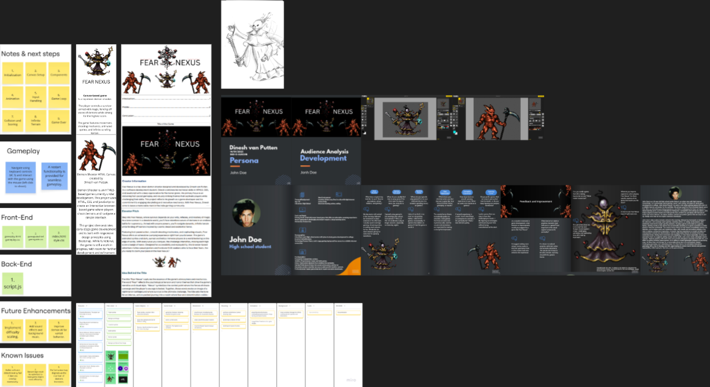
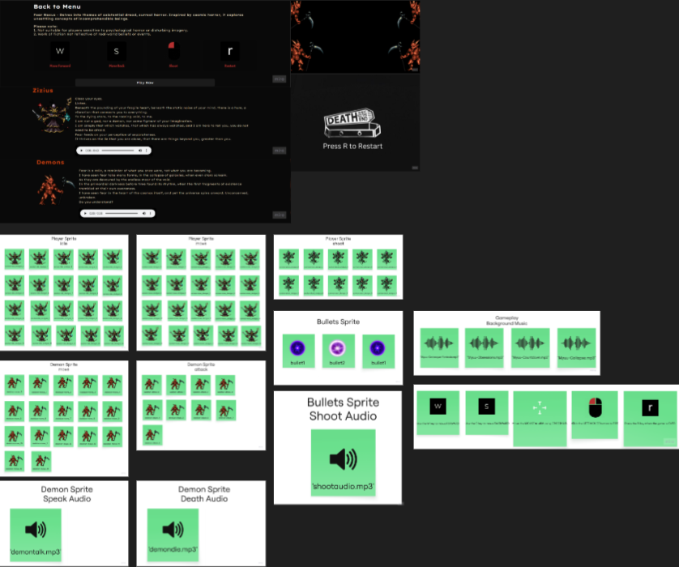
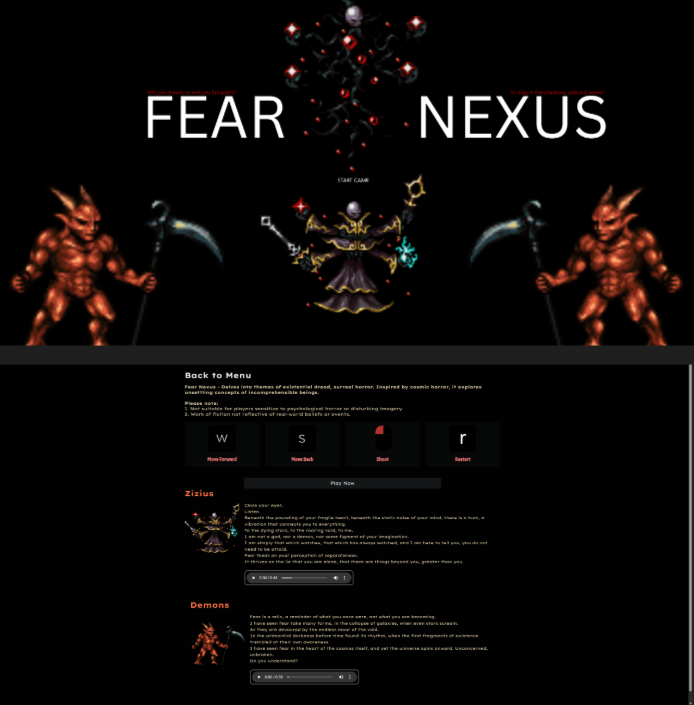

# Fear Nexus


A dark fantasy top down action roguelite survival shooter. Face the relentless swarm, harness forbidden magic, and uncover the truth behind the Fear Nexus.

[Play Live Demo](https://dineshvanputten.com/FearNexus/index.html)


<hr>

## 🎨 Media and Design Artifacts

### Gameplay Trailer
<video controls width="720" poster="images/homebg.png">
  <source src="readme/fearnexustrailer.mp4" type="video/mp4">
  Your browser does not support the video tag.
</video>

> "Trapped within the Fear Nexus, an endless void where time collapses and hope fades, every step draws the darkness closer. Asmodeus waits. The cycle will not break itself. Face what lurks within... or be consumed by it."

### Design Document & UI Evolution




<hr>

## 📖 Description & Overview
Fear Nexus is a 2D top down action roguelite inspired by bullet heaven games. Instead of traditional bullets, the primary threat comes from overwhelming waves of enemies that constantly pursue the player. The game combines elements of survivor like gameplay, incremental progression, and RPG mechanics while maintaining a simple yet addictive gameplay loop.

The player begins each run without any explanation, spawning in the middle of a battlefield filled with monsters. Their objective is simple: survive, become stronger, and defeat every enemy standing in their way.

Combat revolves around automatically generated attacks while the player focuses entirely on movement, positioning, resource management, and strategic upgrade choices.

As enemies are defeated, they grant Experience (XP). Filling the XP bar allows the player to level up and permanently increase either Health or Magic for the current run.

Completing a round unlocks the Upgrade Store, allowing the player to choose one newly unlocked gameplay upgrade.

Enemies also drop Souls, the game's permanent currency. Souls are spent in the Perk Store to purchase upgrades that permanently strengthen future runs.

<hr>

## 📜 Lore & Story

In the beginning, Godthrone opened its eyes. From that first awakening, consciousness was granted to the Purebloods. They were shaped in its image, blessed with its knowledge, and gifted unimaginable power. They received only one command: **Never sit upon the Throne.**

Curiosity eventually consumed Aien. Driven by an overwhelming desire to experience ultimate consciousness, he sought answers from his siblings. Kiana remained silent. Zizius, loyal to God's command, rejected him. Only Xezphine, blessed with foresight, revealed visions that convinced Aien to pursue the impossible.

The First Clash erupted. Aien and Zizius connected directly with the consciousness of Godthrone itself. Reality bent beneath their power. Zizius was consumed by the resulting distortion and transformed into the Fear Nexus. Whether Aien caused the transformation or whether Godthrone itself reacted remains unknown.

Aien now rules upon the Throne. Meanwhile, Zizius awakens inside an endless limbo filled with monsters whose sole purpose is to destroy him.

<hr>

## 🕹️ Controls

<table>
  <tr>
    <th>Action</th>
    <th>Key Input</th>
  </tr>
  <tr>
    <td>Move Forward</td>
    <td>W</td>
  </tr>
  <tr>
    <td>Move Backward</td>
    <td>S</td>
  </tr>
  <tr>
    <td>Aim</td>
    <td>Mouse Movement</td>
  </tr>
  <tr>
    <td>Fire Primary Attack</td>
    <td>Left Click</td>
  </tr>
  <tr>
    <td>Fire Special Attack (Astra)</td>
    <td>Right Click (When Unlocked)</td>
  </tr>
  <tr>
    <td>Restart Run</td>
    <td>R (On Game Over)</td>
  </tr>
</table>

<hr>

## ⚙️ Formal Game Elements

### Players
Fear Nexus is a single player experience requiring constant movement, awareness, and quick decision making. Gameplay alternates between intense combat and short moments of planning, allowing players to carefully choose their next upgrade before jumping back into battle. The game's primary appeal is watching your character evolve from weak to overwhelmingly powerful.

### Objective
* Survive each round.
* Defeat enemies to earn XP.
* Level up by increasing Health or Magic.
* Complete rounds to unlock gameplay upgrades.
* Collect Souls to purchase permanent perks.
* Defeat all 10 rounds to complete the game.

### Core Gameplay Loop
1. Start a run.
2. Defeat enemies.
3. Gain XP.
4. Level up by choosing either Health or Magic.
5. Complete the round.
6. Choose one unlocked Upgrade.
7. Spend Souls in the Perk Store.
8. Begin the next round.
9. Repeat until Round 10 is completed.

### Rules
* Taking damage reduces Health.
* When Health reaches zero, the run ends.
* Each completed XP bar grants one level.
* Every level allows the player to increase either Health or Magic.
* Completing a round allows the player to choose one available Upgrade.
* Souls earned during gameplay are used to purchase permanent Perks.

### Resources
* **Temporary Resources:** Health, Magic, Experience.
* **Permanent Resource:** Souls. Souls persist between runs and are used to purchase permanent upgrades inside the Perk Store.

### Conflict
* The player is constantly surrounded by enemies.
* As the player grows stronger, enemies become stronger as well, forcing continuous adaptation.
* The player can never unlock every ability immediately and must carefully decide which upgrades best suit their build.

### Rounds
* The game contains 10 rounds.
* Round 1 requires defeating 50 enemies.
* Every second round contains boss encounters.
* Boss rounds require defeating all bosses to progress.
* Beginning in later rounds, enemies begin using projectile attacks similar to the player's basic attack.
* Bosses also inherit these attacks while possessing significantly higher Health and Damage.
* Completing Round 10 finishes the game.

<hr>

## 📈 Progression Philosophy & Stores

Fear Nexus uses three interconnected progression layers:
* **Level Progression:** Gain XP to increase Health or Magic.
* **Round Progression:** Complete rounds to choose gameplay upgrades.
* **Permanent Progression:** Earn Souls to purchase permanent Perks.

### Upgrade Store
The Upgrade Store appears after every completed round. Gameplay pauses until the player selects one available upgrade. Unlocked upgrades are accessible via HUD.

* **Lifesteal:** Unlocks after defeating two enemies using a Health ability. Health abilities have a chance to restore Health.
* **Manasteal:** Unlocks after defeating two enemies using a Magic ability. Magic abilities have a chance to restore Magic.
* **Revival:** Unlocked after completing Round 1. Grants one automatic revival each run.
* **Sanguine Aura:** Requires Lifesteal. Every second Health ability activates an aura that damages nearby enemies.
* **Mana Zone:** Requires Manasteal. Remaining stationary for three seconds activates a continuous wave of projectiles.
* **Astra:** Unlocks the right click Special Attack. Consumes Magic to unleash a powerful celestial attack. Can be unlocked free at Round 2 by bypassing normal requirements.
* **Asmodeus:** Unlocked after defeating ten enemies. Unlocks a 50% chance for Asmodeus to appear during boss rounds. Defeating Asmodeus immediately ends the round and grants one additional level.

### Perk Store
The Perk Store is permanently accessible through a HUD button. When enough Souls are collected, notifications alert the player. Contains 7 Perk Trees, each consisting of 16 upgrade nodes:
* Health Regeneration
* Magic Regeneration
* Increased Damage against Mobs
* Increased Damage against Bosses
* Cooldown Reduction
* Damage Mitigation
* XP Gain

<hr>

## 📜 Visual Novel Design Document

### Narrative Purpose
The visual novel is an atmospheric reward between major gameplay milestones. It lasts about 15 minutes total, triggering linear 30 to 60 second scenes before key boss rounds to expand lore, show world understanding, build anticipation, develop Zizius, and present Asmodeus as a threat.

### Scene Structure & Layout

<table>
  <tr>
    <th>Scene</th>
    <th>Trigger</th>
    <th>Tone & Dialogue Outline</th>
  </tr>
  <tr>
    <td>Scene 1: Awakening</td>
    <td>Before Round 1</td>
    <td>Confusion, isolation, fear. Zizius wakes disoriented: "I don't recognize this place... where am I?" Asmodeus echoes: "You never left, Zizius. You are bound here." Zizius steels himself for combat.</td>
  </tr>
  <tr>
    <td>Scene 2: Resolve</td>
    <td>Before Round 2 Boss</td>
    <td>Curiosity, anxiety, survival. Zizius realizes monsters are drawn to his soul. Asmodeus taunts: "You can't win. Your soul is already mine." Zizius pushes forward.</td>
  </tr>
  <tr>
    <td>Scene 3: Focus</td>
    <td>Before Round 4 Boss</td>
    <td>Determination, isolation, unease. Zizius seeks understanding. Asmodeus mocks: "No one will save you. The fear is endless." Zizius braces for battle.</td>
  </tr>
  <tr>
    <td>Scene 4: The Bargain</td>
    <td>Before Round 6 Boss</td>
    <td>Dread, acceptance, curiosity. Memories of Aien resurface. Asmodeus offers: "Give me your soul, Zizius. I can leave through you." Zizius refuses possession.</td>
  </tr>
  <tr>
    <td>Scene 5: Defiance</td>
    <td>Before Round 8 Boss</td>
    <td>Calm determination, resolve. Zizius accepts survival as his purpose: "I won't let him take me." Asmodeus hisses: "This cycle never ends." Zizius fights back with full will.</td>
  </tr>
  <tr>
    <td>Scene 6: Final Stand</td>
    <td>Before Round 10 Boss</td>
    <td>Tension, mystery, tragedy. Memory returns: "Never sit upon the Throne." Zizius affirms: "I don't know who I was, but I know who I am now." Asmodeus falters. The final clash begins.</td>
  </tr>
</table>

### Character Development
* **Zizius:** Evolves from confused, frightened, desperate to curious, searching, questioning, and finally determined, emotionally exhausted, and defiant.
* **Asmodeus:** Never fully explains anything. Mocks, manipulates, and enjoys Zizius's confusion, wanting his soul to escape the prison.

<hr>

## 💡 Comprehensive Developer Q&A

* **How do enemies scale?** Enemies become stronger every round through increased Health and Damage. Later rounds introduce projectile attacks for normal enemies. Bosses inherit these improvements while possessing much higher stats.
* **How are bosses handled?** Bosses appear every second round. Defeating all bosses completes the round. Asmodeus is a special optional boss with a 50% spawn chance after being unlocked. Defeating him instantly completes the round and awards one extra level.
* **Will the game have checkpoints?** Not during early development. Every run is intended to be a fresh start. Checkpoint systems may be considered after core gameplay is completed and balanced.
* **How are upgrades presented?** Completing a round pauses gameplay and displays a full screen Upgrade Store. Players must choose one upgrade before continuing.
* **Why are upgrades linear?** Upgrade Store rewards provide unique mechanics while the Perk Store provides long term specialization. Together they encourage players to create different builds through combinations.
* **How is the game balanced?** It currently is not. Fear Nexus is in its foundation phase. Priority is implementing core mechanics before balancing.
* **Why prioritize implementation before balancing?** Balancing incomplete mechanics is inefficient. Once every system is functional, enemy values, progression speed, and upgrade strength can be adjusted.
* **How will enemy variety evolve throughout development?** Currently uses a universal enemy type. Later, enemies will be divided into Attackers, Defenders, Spellcasters, and Support enemies with unique behaviors.
* **How is player feedback communicated during gameplay?** Visual feedback includes damage numbers, XP numbers, XP bar, level up panel, Upgrade Store overlays, Perk Store notifications, and future sound/voice cues.
* **How do rounds maintain their pacing?** Enemy spawning is infinite. Players complete specific objectives (e.g., Round 1 requires 50 kills, boss rounds require clearing bosses) to progress.
* **How are Souls balanced?** Soul values target 50 Souls for normal enemies, 100 for bosses, and 1,000 for Asmodeus, with early perk nodes costing approximately 100 Souls.
* **How will enemy difficulty evolve throughout the game?** Enemy difficulty increases through round scaling and introducing new enemy archetypes and variants at later rounds.
* **Will players be able to customize their starting character?** No. Every player begins each run under identical conditions.
* **How long should a full run take?** Target runtime for a successful playthrough is 10 to 15 minutes, with rounds lasting 1 to 2 minutes.
* **Will Fear Nexus contain replayability systems?** Replayability features like additional game modes, daily challenges, endless mode, and score systems are planned for post core development.
* **Will upgrades include risk versus reward mechanics?** Not initially. The final design includes 21 gameplay upgrades. Trade offs or negative modifiers may be introduced during later balancing.
* **Will the game include story sequences?** Yes, visual novel style scenes trigger before major boss encounters.
* **How will players feel rewarded?** Audiovisual feedback including damage numbers, combat dialogue, voice lines, special attack reactions, and ambient audio.
* **What accessibility features are planned?** Difficulty selection, audio controls, and interface customization planned after balancing.
* **How will saving work?** Early development uses fresh starts. Save points after major boss rounds may be introduced later.
* **How does the game handle downtime?** Hard pauses occur during level up, Upgrade Store access, and story scenes.
* **Will the game include a tutorial?** Either a dedicated tutorial level or context sensitive tips during Round 1 will be selected based on playtesting.
* **Which platforms are planned?** Developed exclusively for PC browser. Mobile may be considered in the future.
* **What art style is planned?** Placeholder assets are used for rapid prototyping and will be replaced with original artwork.
* **What music style fits Fear Nexus?** A dark ambient soundtrack to maintain tension and atmosphere.
* **Will the game feature multiple difficulty modes?** Not during early development, but planned for future updates.

<hr>

## 🛠️ Project Structure & Refactoring Workflow

### Project Map
```text
/FearNexus
├── audio/          # Music & SFX
├── assetsplayer/   # Animated character sprites
├── images/         # Backgrounds & UI elements
├── index.html      # Start Menu & Game Layout
├── style.css       # Core styling
└── script.js       # Game logic & loop