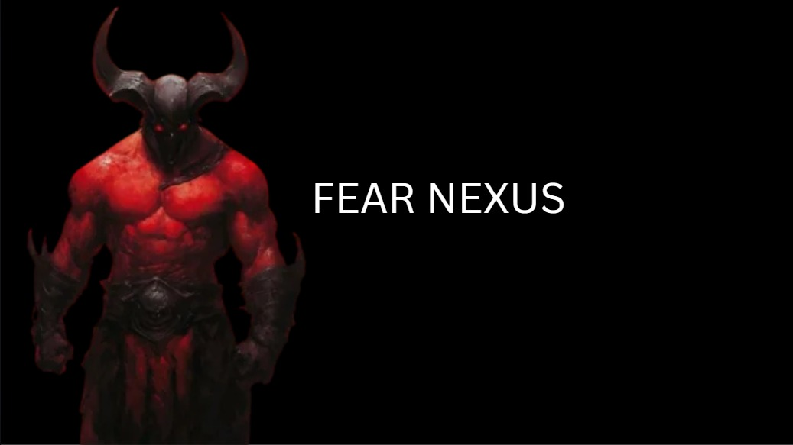

# Fear Nexus



A post-apocalyptic top-down survival shooter. Face the relentless swarm. Uncover the truth behind the Fear Nexus.

[Play Live Demo](https://dineshvanputten.com/FearNexus/index.html)


---

## 📖 Overview
Fear Nexus is a high-intensity survival experience. As Zizius, you are trapped in a world where fear is a weapon. Fight off waves of experimental undead, manage your resources, and survive the encroaching darkness.

## 🕹️ Controls
| Action | Key |
| :--- | :--- |
| Move Forward | W |
| Move Backward | S |
| Aim | Mouse Movement |
| Fire | Left Click |
| Restart | R (on Game Over) |

## 🚀 Key Features
* Dynamic Survival: Difficulty scales as you survive longer.
* Fluid Animation: Custom-rendered sprite sequences for movement and combat.
* Immersive Audio: Atmospheric soundscapes and reactive combat effects.
* Infinite Terrain: Seamlessly looping world architecture.

---

## 🛠️ Tech Stack & Structure
### Built With
* Canvas API: For high-performance 2D rendering.
* Bootstrap: For responsive UI and menu layouts.
* Local Storage: Persistent high-score tracking.

### Project Map
```text
/FearNexus
├── audio/          # Music & SFX
├── assetsplayer/   # Animated character sprites
├── images/         # Backgrounds & UI elements
├── index.html      # Start Menu
├── style.css       # Core styling
└── script.js       # Game logic & loop